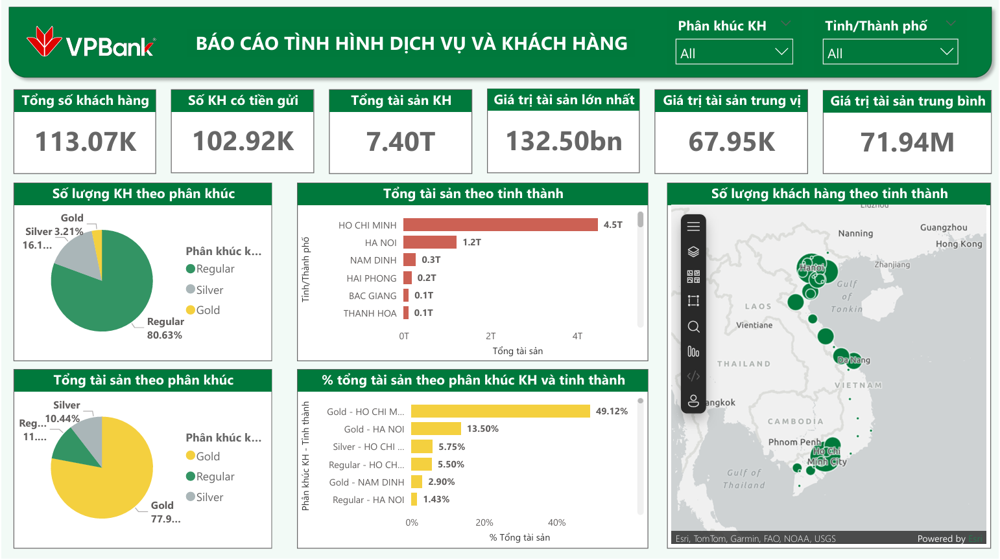
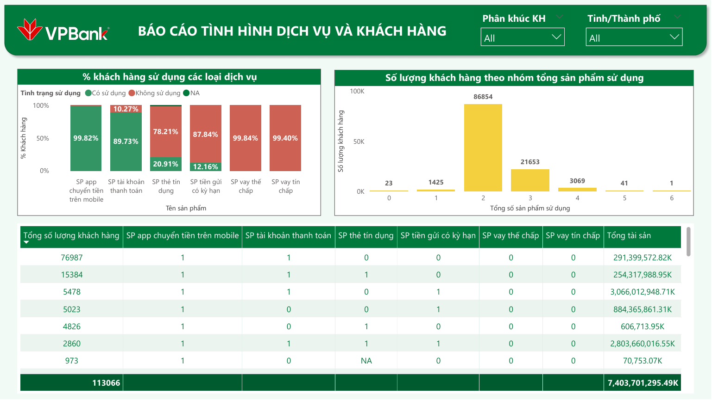

# VPBank Financial Service & Customer Analysis

---

# Project Objectives
- Provide an overview of customer behavior and financial service usage at VPBank.
- Propose business strategies to achieve the next quarter KPI target of +20% revenue growth.

# Dataset

| File | Description |
|---|---|
| aum.csv | Customer deposit balances |
| cust.csv | Customer segment and location information |
| prod_holding.csv | Financial services used by customers |

# Key Insights
- Customer deposits are highly concentrated in a small customer group.
- Ho Chi Minh City customers show stronger financial engagement.
- North Central region has strong retail banking potential.
- Adoption of core financial products remains low.

# Business Recommendations
- Increase cross-sell opportunities for credit card customers.
- Reactivate low-engagement customers through promotions and cashback campaigns.
- Focus on high-value customers in Ho Chi Minh City.
- Expand retail banking activities in the North Central region.
- Simplify loan approval and onboarding processes.

# Dashboard Preview

